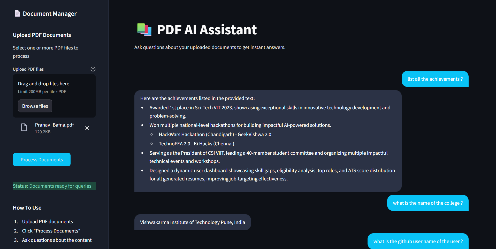

# PDF AI Assistant

A modern application that allows you to chat with your PDF documents using Google's Gemini AI. Upload multiple PDFs and ask questions to get instant, accurate answers based on the document content.



## ✨ Features

- **Document Processing**: Upload and process multiple PDF documents
- **AI-Powered Q&A**: Ask questions about your documents and receive instant answers
- **Modern UI**: Clean, dark-mode interface with intuitive design
- **Conversation History**: Keep track of your conversation with the AI
- **Local Processing**: Documents are processed locally for privacy

## 🚀 Getting Started

### Prerequisites

- Python 3.8 or higher
- Git

### Installation

1. **Clone the repository**

   ```bash
   git clone https://github.com/yourusername/Local-AI-Agent.git
   cd Local-AI-Agent
   ```

2. **Create a virtual environment**

   ```bash
   python -m venv venv
   ```

3. **Activate the virtual environment**

   - Windows:

     ```bash
     venv\Scripts\activate
     ```

   - macOS/Linux:
     ```bash
     source venv/bin/activate
     ```

4. **Install dependencies**

   ```bash
   pip install -r requirements.txt
   ```

5. **Set up environment variables**

   Create a `.env` file in the project root directory with the following variables:

   ```
   GOOGLE_API_KEY=your_gemini_api_key
   HUGGINGFACEHUB_API_TOKEN=your_huggingface_token
   ```

   To get these API keys:

   - Get a Google Gemini API key from [Google AI Studio](https://ai.google.dev/)
   - Get a HuggingFace API token from [HuggingFace](https://huggingface.co/settings/tokens)

## 🔧 Usage

1. **Start the application**

   ```bash
   streamlit run app.py
   ```

2. **Access the application**

   Open your web browser and go to `http://localhost:8501`

3. **Using the application**

   - Upload PDF documents using the sidebar
   - Click "Process Documents" to analyze the content
   - Ask questions about your documents in the chat interface
   - Receive AI-generated answers based on the document content

## 📋 Dependencies

- **Streamlit**: Web application framework
- **LangChain**: Framework for LLM applications
- **Google Gemini API**: AI language model
- **HuggingFace**: Embeddings for document processing
- **PyPDF2**: PDF parsing library
- **FAISS**: Vector database for document storage and retrieval
